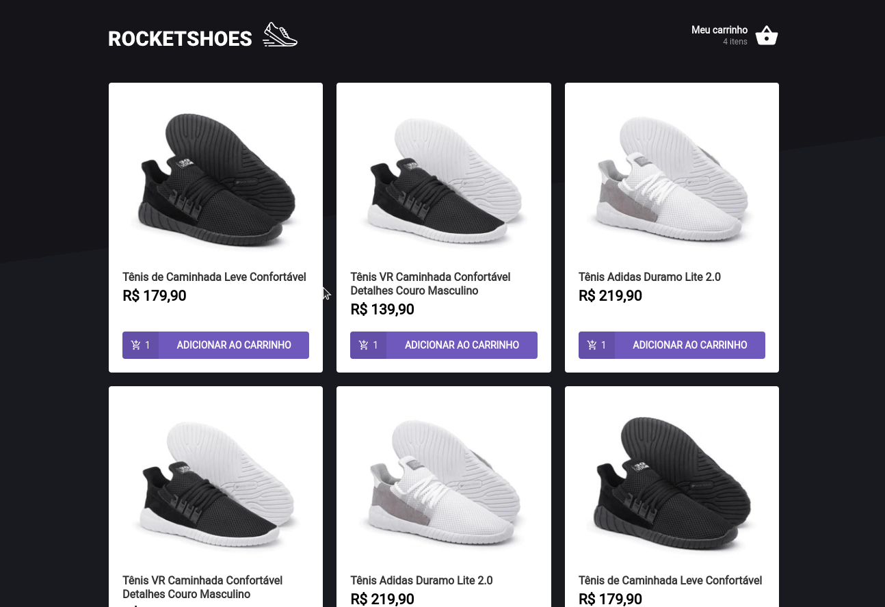

<h3 align="center">
  Desafio 01 - Conceitos do React
</h3>

<p align="center">
  <a href="https://rocketseat.com.br">
    
  </a>
  
  <a href="https://www.linkedin.com/in/rafaeldcmartins/">
    
  </a>
  
  <a href="https://www.linkedin.com/in/rafaeldcmartins/">
    
  </a>
  
</p>

<br>

## :rocket: Sobre o desafio
<p align="center">
  
</p>

Nesse desafio, foi criada uma aplicação para treinar o que foi aprendido durante o módulo 2, onde o seu principal objetivo é uma pequena aplicação de marketplace, para treinar sobre estruturação da aplicação, componentização, consumo de API, contextos e hooks.

- Adicionar um produto ao carrinho
- Remover produto do carrinho
- Adicionar ou decrementar produtos dentro do carrinho
- Listagem de produtos

### Lib's utilizadas
Dentro do projeto utilizamos o `JSON Server` para fazer um fake api, o `localStorage API` para armazenar os dados no navegador num esquema de chave-valor e o `toastify` para mostrar informações para o usuário.

### Funcionalidades da aplicação

Dentro da pasta `src/hooks` temos o `useCart` que detém grande parte da funcionalidade do nosso app e dentro dele temos: 
- **`Cart State`**: Lidamos com o estado dentro do contexto e disponibilizamos para todos utilizare;

- **`addProduct`**: Função que lida com a adição de um novo produto dentro do carrinho. Recebe como parâmetro o `productId`.

- **`removeProduct`**: Deve remover o produto da lista

- **`updateProductAmount`**: Recebe o `productID` e o `amount` que será incrementado ou decrementado.

Na page `src/pages/Cart` utilizamos o `useCart` para ter acesso ao contexto, formatamos o card com as novas informações de `priceFormatted` e `subTotal` e, por fim, calculamos o `total` a ser exibido com o auxílio da função `formatPrice`

Na page `src/pages/Home` utilizamos o `useCart` para ter acesso ao contexto, utilizamos um `reducer` para obter os valores da quantidade de cada produto, fazemos o `fetch` inicial dos dados de produtos e listamos eles.

No componente `src/components/Header` utilizamos o `useCart` para ter acesso ao contexto e mostramos a quantiade de itens no carrinho.


### Específicação dos testes

Em cada teste, tem uma breve descrição no que a aplicação deve cumprir para que o teste passe.

Para esse desafio temos os seguintes testes:

- **`should be able to render the amount of products added to cart`**: Para que esse teste passe você deve renderizar o valor correto da quantidade de tipos de produtos

- **`should be able to render each product quantity added to cart`**: Para que esse teste passe você deve renderizar corretamente a quantidade adicionada de cada produto adicionado ao carrinho dentro da tag `<div data-testid="cart-product-quantity">`. Sugerimos criar uma variável `cartItemsAmount` utilizando o método `reduce` para iterar sobre os produtos adicionados ao `cart` e gerar um array com o formato necessário

- **`should be able to add a product to cart`**: Para que esse teste passe você deve clicar no botão ADICIONAR AO CARRINHO e o produto escolhido ser adicionado com sucesso ao carrinho. Além disso, a quantidade do produto no carrinho mostrada no botão deve representar o novo valor (incrementado de 1 unidade).

- **`should be able to increase/decrease a product amount`**: Para que esse teste passe você deve renderizar corretamente o valor da quantidade de cada produto adicionado ao carrinho e ser capaz de incrementar e decrementar os valores ao clicar no botões `<button *data-testid*="increment-product">` e `<button *data-testid*="decrement-product">` respectivamente


- **`should not be able to decrease a product amount when value is 1`**: Para que esse teste passe você deve desabilitar o botão `<buttondata-testid="decrement-product">` quando a quantidade do produto for igual a 1.

- **`shoud be able to remove a product`**: Para que esse teste passe você deve ser capaz de remover o produto do carrinho ao clicar no botão `<buttondata-testid="remove-product">`

- **`should be able to initialize cart with localStorage value`**: Para que esse teste passe você deve inicializar o estado `cart` com o valor da key `@RocketShoes:cart` do localStorage caso ele exista.
    
- **`should be able to add a new product`**: Para que esse teste passe você deve utilizar a função `addProduct` para adicionar um novo produto ao carrinho e preservar o valor atualizado do carrinho no localStorage utilizando o `setItem`.
    
- **`should not be able add a product that does not exist`**: Para que esse teste passe você deve utilizar a função `addProduct` para verificar que o produto não existe, mostrar um `toast.error` com a mensagem `Erro na adição do produto` e sair da função sem alterar o `cart` e o valor no localStorage.
    
- **`should be able to increase a product amount when adding a product that already exists on cart`**: Para que esse teste passe você deve utilizar a função `addProduct` para incrementar em 1 unidade a quantidade de um produto no carrinho em vez de adicionar um novo produto. Deve também preservar o valor atualizado do carrinho no localStorage utilizando o `setItem`.
    
- **`should not be able to increase a product amount when running out of stock`**: Para que esse teste passe você deve utilizar a função `addProduct` para verificar que a quantidade desejada do produto não possui em estoque (rota `stock/id` da Fake API). Deve também mostrar um `toast.error` com a mensagem `Quantidade solicitada fora de estoque` e sair da função sem alterar o `cart` e o valor no localStorage.
    
- **`should be able to remove a product`**: Para que esse teste passe você deve utilizar a função `removeProduct` para remover um produto do carrinho. Deve também preservar o valor atualizado do carrinho no localStorage utilizando o `setItem`.
    
- **`should not be able to remove a product that does not exist`**: Para que esse teste passe você deve utilizar a função `removeProduct` para verificar que o produto não existe no carrinho e mostrar um `toast.error` com a mensagem `Erro na remoção do produto`. Deve também sair da função sem alterar o `cart` e o valor no localStorage.
    
- **`should be able to update a product amount`**: Para que esse teste passe você deve utilizar a função `updateProductAmount` para incrementar e decrementar o valor de um produto no carrinho. Deve também preservar o valor atualizado do carrinho no localStorage utilizando o `setItem`.
    
- **`should not be able to update a product that does not exist`**: Para que esse teste passe você deve utilizar a função `updateProductAmount` para verificar que o produto não existe e mostrar um `toast.error` com a mensagem `Erro na alteração de quantidade do produto`. Deve também sair da função sem alterar o `cart` e o valor no localStorage.
    
- **`should not be able to update a product amount when running out of stock`**: Para que esse teste passe você deve utilizar a função `updateProductAmount` para verificar que a quantidade desejada do produto não possui em estoque (rota `stock/id` da Fake API). Deve também mostrar um `toast.error` com a mensagem `Quantidade solicitada fora de estoque` e sair da função sem alterar o `cart` e o valor no localStorage.
    
- **`should not be able to update a product amount to a value smaller than 1`**: Para que esse teste passe você deve utilizar a função `updateProductAmount` para verificar que a quantidade desejada do produto é menor que 1 e sair imediatamente da função sem alterar o `cart` e o valor no localStorage.

<br>

## :wrench: Instalação e uso

```bash
# Abra um terminal e copie este repositório com o comando
git clone https://github.com/matheusm/Rocketshoes

# ou use a opção de download.

# Entre na pasta com 
cd Rocketshoes

# Instale as dependências
yarn install

# Inicie a Fake API
yarn server

# Rode a aplicação
yarn start

# Acesse http://localhost:3000 no seu navagador
```

<br>

## :memo: Licença

Esse projeto está sob a licença MIT. Veja o arquivo [LICENSE](/LICENSE) para mais detalhes.

---

Feito com :purple_heart: by [Matheus Martins](https://github.com/matheusms)

Este README foi inspirado por: [@martins-rafael](https://github.com/martins-rafael)

[](https://www.linkedin.com/in/matheus-martins-sarmento/) 
